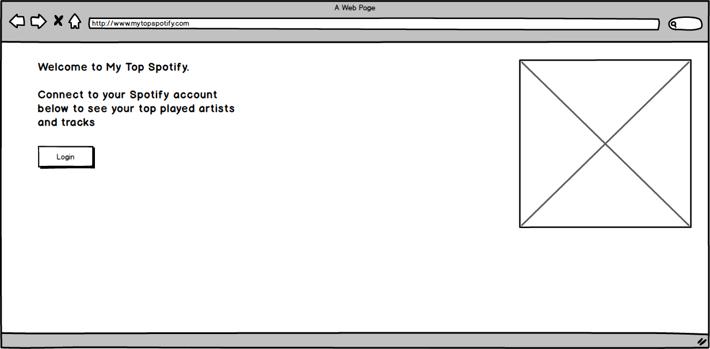
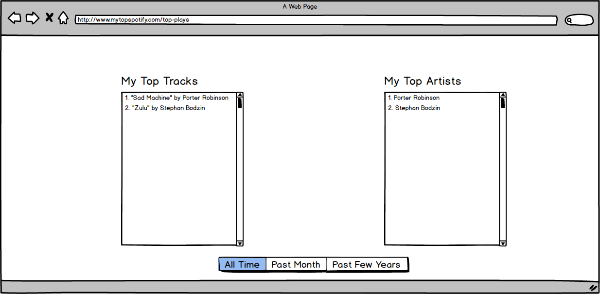
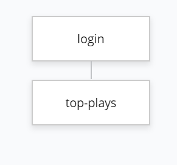

#  My Top Spotify

## Overview

**Spotify** is awesome. You can listen to music on the go, offline, with high quality audio. You get personalized playlists, access to an unparalleled catalog of songs, and a sleek, seamless UI.

But, ever wondered what your most played tracks are? How about your most played artists? Spotify may gave you those stats in their annual **Year Wrapped** feature, but what if you wanted to know right this second? 

Enter **My Top Spotify**. Connect your Spotify account to My Top Spotify to get access to your top 50 most played tracks and artists. Wanna put those top played tracks into their own playlists so you can bump them later? Got you covered. 


## Data Model

The application will store Users, Tracks, and Tracklists

**Users**
* Can have multiple tracklists based on time or type (via references)

**Tracklists**
* Can contain multiple tracks (by embedding)
* Can be based on either top played artists or top played tracks
* Can vary based on desired time scope

**Tracks**
* Can contain various amounts of metadata 
* Can be played via user’s active device

An example User:

```javascript
{
  username: "technojunkie",
  hash: // a password hash,
  tracklists: // an array of references to Tracklist documents
}
```

An example Tracklist with embedded items:

```javascript
{
  user: // a reference to a User object
  title: "Top 50 Played Tracks",
  tracks: [
    { title: "Sad Machine", artist: "Porter Robinson", album: "Worlds"},
    { title: "Zulu", artist: "Stephan Bodzin", album: "Powers of Ten"},
    // ... continues with additional unique tracks till 50 track limit
  ]
}
```

An example Track:

```javascript
{
  title: "Spider On the Moon", 
  artist: "Rezz", 
  album: "Certain Kind of Magic"
}
```

## [Link to Commented First Draft Schema](src/db.js) 

## Wireframes

/ - home page for user to connect to their Spotify account



/top-plays - page for showing user's top played artists and tracks



## Site map



## User Stories or Use Cases

1. as non-connected user, I can connect my Spotify account to enter the site
2. as a user, I can view my top played artists
3. as a user, I can view my top played tracks
4. as a user, I can filter my top played artists by time
5. as a user, I can filter my top played tracks by time
6. as a user, I can make a new Spotify playlist out of my top played tracks
7. as a user, I can view specific metadata about one of my top played tracks
8. as a user, I can view specific metadata about one of my top played artists

## Research Topics

* **(2 points) Node.js wrapper library for Spotify's Web API**
  * **WHAT**: Handy Node.js library that simplifies a lot of the low level request-response handling with Spotify's Web API. Puts a layer of abstraction over retreiving JSON metadata about music, artists, albums, and tracks, directly from the Spotify Data Catalogue. Includes helper functions to retreive music metadata, perform searches, gather user info, and more. 
  * **WHY**: Abstraction the library provides allows time for focusing on other aspects of the project rather than just dealing with Spotify's Web API. Additionally, the library functions are built with a strong focus on callbacks. We have been using callbacks heavily in this course, so it's nice to be able to put them to use here too.  
* **(1 points) Spotify Web API**
  * **WHAT**: Based on simple REST principles, the Spotify Web API endpoints return JSON metadata about music, artists, albums, and tracks, directly from the Spotify Data Catalogue. Web API also provides access to user related data, like playlists and music that the user saves in the "Your Music" library. Such access is enabled through selective authorization, by the user.
  * **WHY**: As fate would have it, one of the only functions the Node.js wrapper library mentioned above doesn't have is one to retrieve top played tracks/artists. Therefore, will have to use the Spotify Web API directly to do that. Not complaining! Will be nice to see the similarities/differences between implementation of the wrapper vs direct API. 
* **(4 points) Vue**
    * **WHAT**: JS framework with various optional tools for building UIs. Adds JS functionality within HTML documents. Small size, simple integration and detailed documentation.
    * **WHY**: Frontend frameworks are all the rage these days. I've fiddled with Vue a LITTLE before, but yet to build a full-fledged app out of it. Would love to change that with this project.
* **(2 points) Bootstrap**
  * **WHAT**: Arguably the best CSS framework around for responsive design. It has great templates for typography, forms, buttons, tables, navigation, modals, image carousels, and other elements. Built by Twitter engineers!
  * **WHY**: CSS isn't my strong suit. So, of course, Bootstrap is my saviour! It's easy to use, responsive to different devices, and has great documentation.

*9 points total out of 8 required points*

## [Link to Initial Main Project File](src/app.js) 

## Annotations / References Used

1. Spotify Web API: https://developer.spotify.com/documentation/web-api/
2. Node.js wrapper library for Spotify's Web API: https://github.com/thelinmichael/spotify-web-api-node
3. Bootstrap docs: https://getbootstrap.com/ 
4. Vue docs: https://vuejs.org/
