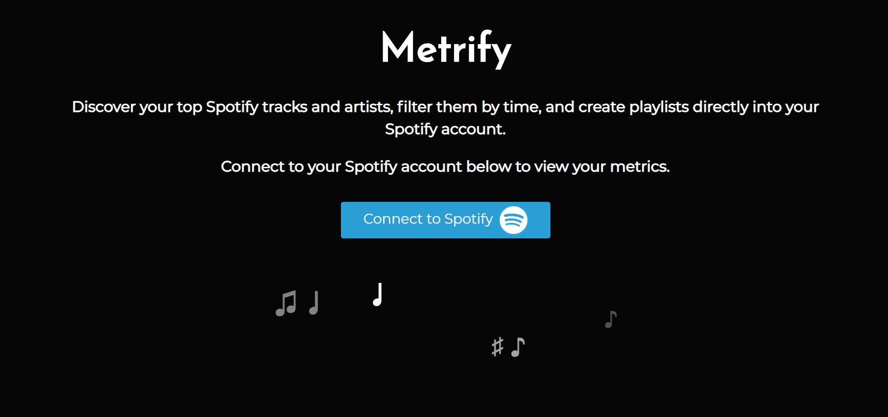
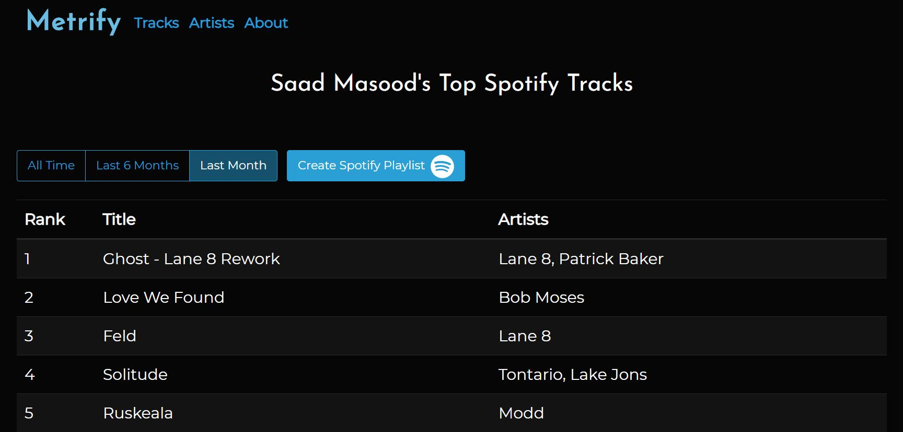
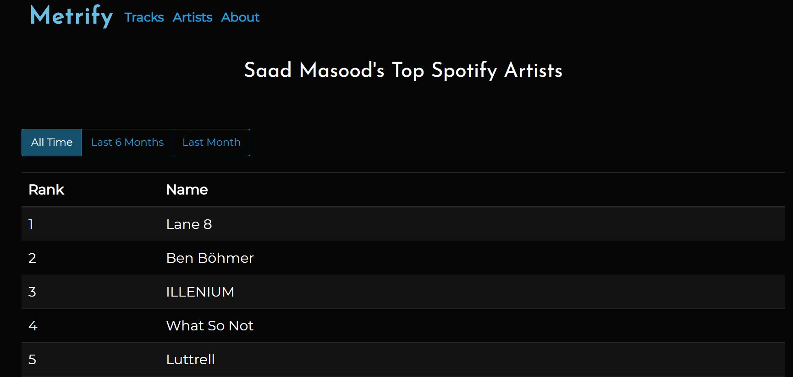
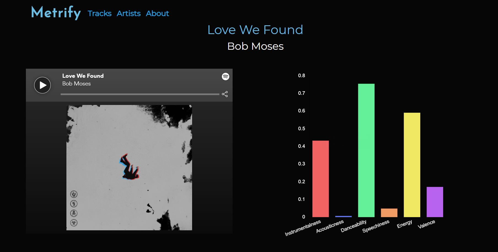
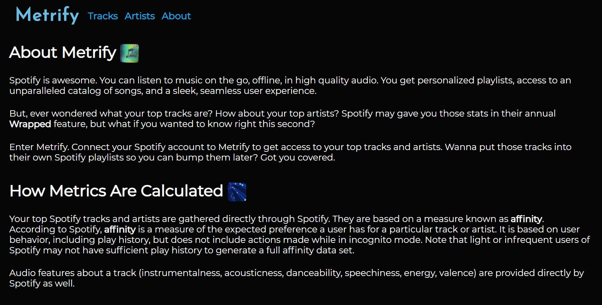
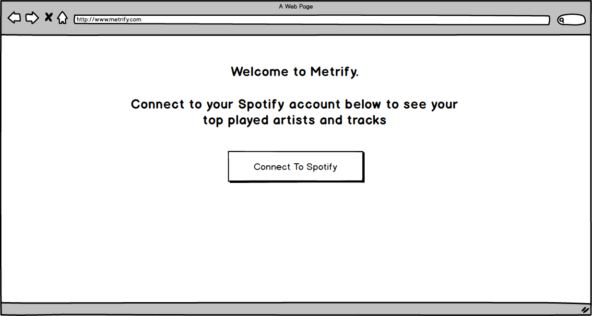
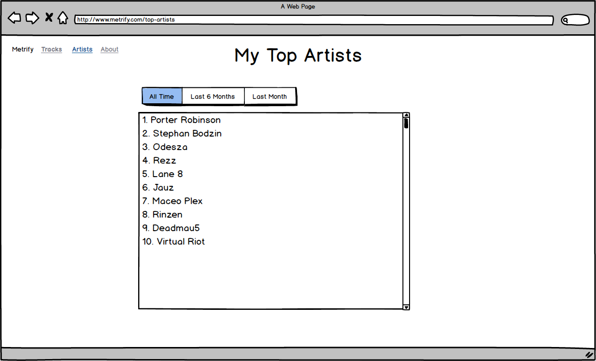
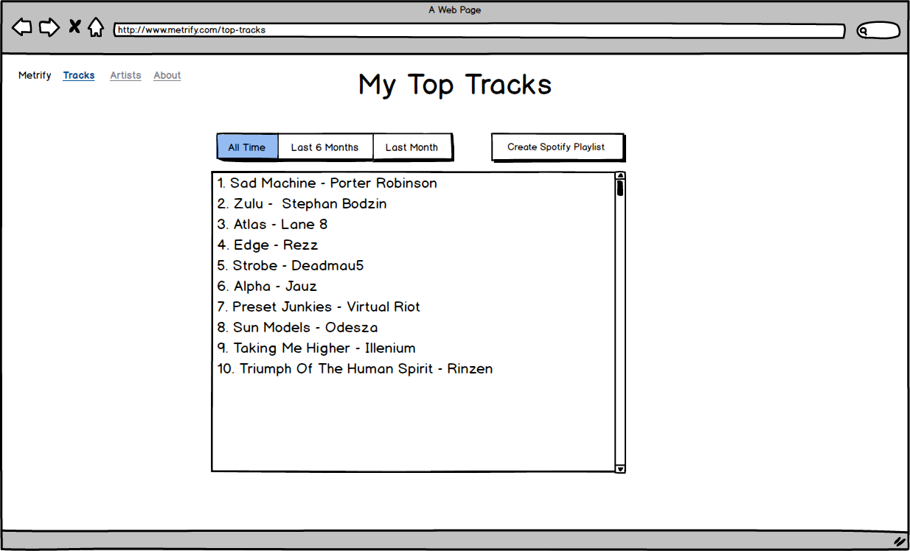
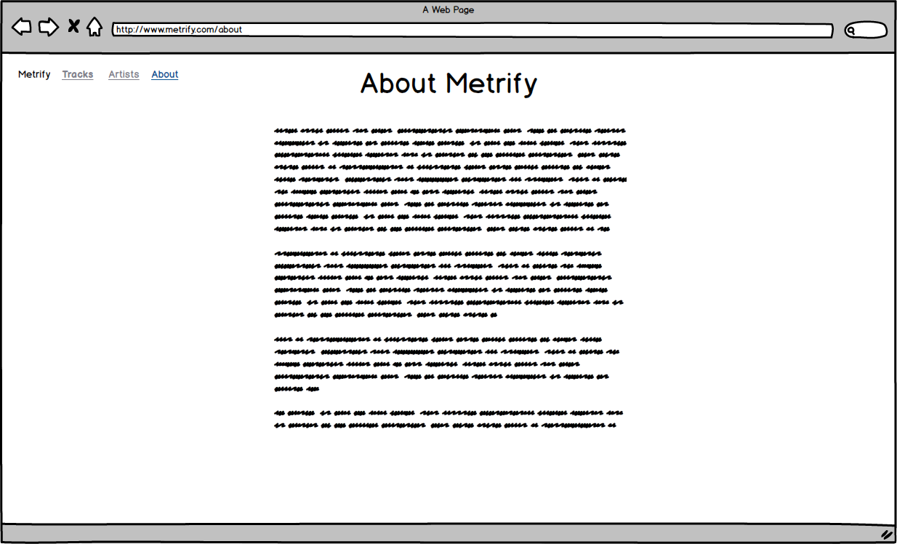
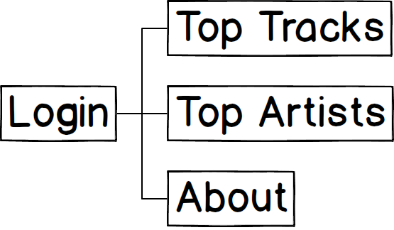

#  Metrify

## Overview

**Spotify** is awesome. You can listen to music on the go, offline, in high quality audio. You get personalized playlists, access to an unparalleled catalog of songs, and a sleek, seamless UI.

But, ever wondered what your top tracks are? How about your top artists? Spotify may gave you those stats in their annual "Wrapped" feature, but what if you wanted to know right this second? 

Enter **Metrify**. Connect your Spotify account to Metrify to get access to your top 50 top tracks and artists. Wanna put those tracks into their own Spotify playlists so you can bump them later? Got you covered. 

## Screenshots

### Landing Page



### Top Tracks



### Top Artists



### Track Features



### About Page



## Data Model

The application stores Users, Tracks, and Artists

**Users**
* Can have multiple tracklists based on time (all time, last 6 months, last month) 
* Can have multiple artist lists based on time (all time, last 6 months, last month) 
* Tracklists are stored by embedding tracks within an array 
* Artist lists are stored by embedding artists within an array 

**Tracks**
* Contain spotify ID, title, and an array of embedded artists

**Artists**
* Contain spotify ID and name

An example User:

```javascript
{
  spotifyID: "technojunkie",
  token: "XyAq123941XjpqR713",
  topTracksLong: [TrackSchema],
  topTracksMedium: [TrackSchema],
  topTracksShort: [TrackSchema],

  topArtistsLong: [ArtistSchema],
  topArtistsMedium: [ArtistSchema],
  topArtistsShort: [ArtistSchema],
}
```

An example Artist:

```javascript
{
  name: "Stephan Bodzin",
  spotifyID: "1112495" 
}
```

An example Track:

```javascript
{
  title: "Spider On the Moon", 
  artist: [Rezz], 
  spotifyID: "1112495"
}
```

## Wireframes

/ - home page for user to connect to their Spotify account



/top-artists - page for user's top artists



/top-tracks - page for user's top tracks



/about - page for info about website 



## Site map

### NOTE: site map is outdated; Track Features page was added to the app but is missing from the site map



## User Stories

1. As non-connected user, I can connect my Spotify account to enter the site
2. As a user, I can view my top artists
3. As a user, I can view my top tracks
4. As a user, I can filter my top artists by time
5. As a user, I can filter my top tracks by time
6. As a user, I can make a new Spotify playlist out of my top tracks
7. As a user, I can make view audio features of my top tracks